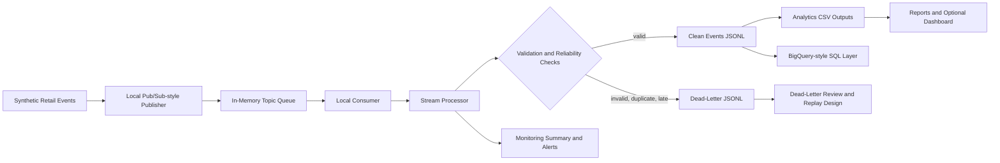

# GCP Real-Time Data Engineering Platform

A local-first, GCP-aligned real-time retail event analytics platform that demonstrates streaming ingestion, validation, processing, reliability, analytical modelling, monitoring, and dashboard-ready reporting without provisioning cloud resources.

## Problem Statement

Retail and customer analytics platforms need to ingest event streams, validate data quality, process events reliably, handle duplicates and late arrivals, isolate bad records, and publish analytical outputs that can support operational and business dashboards. The challenge is not only processing events, but designing clear boundaries for ingestion, messaging, stream processing, data quality, replay, observability, warehouse modelling, and reporting.

This repository implements those boundaries locally in Python and documents how they map to a production GCP architecture.

## What This Project Demonstrates

- Real-time data engineering and streaming event pipeline design.
- Pub/Sub-style event ingestion using local publisher, consumer, and queue abstractions.
- Dataflow / Apache Beam architecture thinking through an import-safe reference skeleton.
- BigQuery-style analytical modelling with Standard SQL design files.
- Data quality validation, scoring, and schema checks.
- Duplicate detection, late-event handling, dead-letter routing, replay review, and idempotent processing.
- Operational monitoring, threshold alerting, and local reporting.
- Dashboard-ready analytics outputs and optional local Streamlit reporting surface.
- Distributed systems reliability thinking with at-least-once delivery assumptions.
- Production-style Python project structure with tests, CI, docs, and modular code.

## Architecture Overview



Additional Mermaid diagrams live in `diagrams/`.

## Local-First Implementation Note

This project is intentionally local-first. It does not create GCP resources, require credentials, run Dataflow, connect to Pub/Sub, query BigQuery, write Cloud Storage, publish Cloud Logging entries, create Cloud Monitoring alerts, or connect to Looker Studio.

All cloud references are architecture mappings for a future production deployment.

## GCP Service Mapping

| Capability | Local implementation | GCP-aligned mapping |
| --- | --- | --- |
| Event ingestion | JSONL sample events and local publisher | Pub/Sub topic |
| Message consumption | Local consumer and in-memory queue | Pub/Sub subscription |
| Stream processing | `LocalStreamProcessor` and Beam reference skeleton | Dataflow / Apache Beam |
| Raw event archive | `data/sample/*.jsonl` and local artifacts | Cloud Storage raw archive |
| Analytical warehouse | `sql/*.sql` and local CSV outputs | BigQuery datasets, tables, and views |
| Dashboard layer | Markdown reports and optional Streamlit app | Looker Studio |
| Logs | Local summaries and reports | Cloud Logging structured logs |
| Metrics and alerts | Local monitoring JSON and alert rules | Cloud Monitoring metrics and alert policies |
| Secrets | No secrets used or committed | Secret Manager in a real deployment |
| Governance | Documentation and schemas | Dataplex / Data Catalog |

## End-To-End Local Workflow

```bash
python -m venv .venv
source .venv/bin/activate
python -m pip install -r requirements.txt

python -m pytest
python scripts/generate_demo_events.py
python scripts/run_local_stream.py
python scripts/run_quality_checks.py
python scripts/generate_reports.py
python scripts/run_dead_letter_review.py
python pipelines/apache_beam_pipeline.py --describe
```

Optional dashboard, if Streamlit is installed:

```bash
python -m streamlit run dashboard/streamlit_app.py
```

## Outputs Generated

| Output | Purpose |
| --- | --- |
| `data/sample/*.jsonl` | Deterministic synthetic customer, product, transaction, and session events. |
| `outputs/clean_events.jsonl` | Valid transformed events from the local stream processor. |
| `outputs/dead_letter_events.jsonl` | Rejected malformed, duplicate, late, or invalid events. |
| `outputs/event_quality_summary.json` | Validation and data quality scoring summary. |
| `outputs/stream_processing_summary.json` | Processing counts, duplicate counts, late-event counts, and errors. |
| `outputs/*.csv` | Dashboard-ready analytical aggregations. |
| `outputs/pipeline_monitoring_summary.json` | Local operational metrics and alert results. |
| `outputs/dead_letter_review_summary.json` | Replay candidate and dead-letter reason summary. |
| `reports/analytics_summary.md` | Portfolio-ready analytics summary report. |
| `reports/pipeline_monitoring_report.md` | Operational monitoring report. |
| `reports/dead_letter_review_report.md` | Dead-letter review and replay report. |

## Repository Structure

```text
.
├── configs/      # Local pipeline, event generation, quality, monitoring, and table configs
├── data/         # Local sample/raw/processed data folders
├── src/          # Python package for generation, local messaging, processing, analytics, monitoring, reporting
├── pipelines/    # Local DirectRunner-safe Beam/Dataflow reference design
├── sql/          # BigQuery Standard SQL schemas and transformation models
├── docs/         # Architecture, runbook, reliability, governance, monitoring, roadmap, limitations
├── diagrams/     # Mermaid architecture and workflow diagrams
├── dashboard/    # Optional local Streamlit dashboard
├── outputs/      # Generated local JSONL, CSV, and JSON artifacts
├── reports/      # Generated Markdown reports
├── tests/        # Unit and documentation completeness tests
└── scripts/      # Local workflow commands
```

## How To Run

Install dependencies:

```bash
python -m venv .venv
source .venv/bin/activate
python -m pip install -r requirements.txt
```

Generate synthetic events:

```bash
python scripts/generate_demo_events.py
```

Run the local stream pipeline:

```bash
python scripts/run_local_stream.py
```

Run quality checks:

```bash
python scripts/run_quality_checks.py
```

Generate analytics, monitoring, and analytics summary report:

```bash
python scripts/generate_reports.py
```

Run dead-letter review:

```bash
python scripts/run_dead_letter_review.py
```

Review Beam/Dataflow reference:

```bash
python pipelines/apache_beam_pipeline.py --describe
```

Run tests and linting:

```bash
ruff format --check .
ruff check .
pytest
```

## Milestone Summary

1. Professional scaffold and CI.
2. Deterministic synthetic retail/customer events.
3. Local Pub/Sub-style publisher, consumer, queue, and replay.
4. Event schema validation, quality rules, scoring, and summary.
5. Local stream processor, transformations, clean output, dead-letter output, idempotency.
6. Dashboard-ready analytics CSV outputs.
7. BigQuery-style SQL data model.
8. Local monitoring metrics, alert rules, and monitoring report.
9. Dead-letter inspection, replay candidate selection, retry policy, reliability report.
10. Apache Beam / Dataflow reference skeleton and GCP architecture docs.
11. Local dashboard/reporting layer and analytics summary report.
12. Final architecture, runbook, roadmap, limitations, and portfolio polish.

## Portfolio Positioning

This project is a professional GCP-aligned data engineering portfolio repository. It shows how a streaming retail analytics platform can be structured, tested, and documented before live cloud deployment. The implementation emphasizes local reproducibility, modular Python engineering, reliability patterns, data quality, analytical modelling, observability, and cloud architecture mapping.

## Limitations

- Local-first simulation only.
- Synthetic data only.
- No live GCP resources are provisioned.
- No real Pub/Sub, Dataflow, BigQuery, Cloud Storage, Cloud Logging, Cloud Monitoring, Secret Manager, Dataplex, Data Catalog, or Looker Studio calls are made.
- Apache Beam / Dataflow code is a reference skeleton and is not executed as a Dataflow job.
- BigQuery SQL is design/portfolio SQL and is not executed against BigQuery.
- Monitoring uses local output files, not Cloud Monitoring.
- Dashboard is local and optional.
- No benchmarking or production SLO claims are included.

## Future Production Roadmap

A future production deployment would require explicit steps for GCP project setup, IAM, Pub/Sub topics and subscriptions, Cloud Storage raw archive, Dataflow deployment, BigQuery datasets and tables, dead-letter topics/tables, Cloud Logging and Cloud Monitoring, Looker Studio connectivity, CI/CD deployment, Secret Manager, governance/catalog integration, and cost controls.

See [docs/production_roadmap.md](docs/production_roadmap.md) for details.

## No Credentials Or Cloud Cost

The repository is safe to run locally without GCP credentials. It does not create billable cloud resources.
