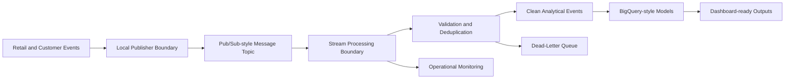

# GCP Real-Time Data Engineering Platform

A local-first, GCP-aligned real-time data engineering platform scaffold for retail and customer event analytics.

This repository is designed to show how a production-style streaming analytics platform can be structured before cloud resources are introduced. The project maps local modules and design documents to common GCP services such as Pub/Sub, Dataflow, BigQuery, Cloud Logging, and Cloud Monitoring, while staying local-first and testable.

## Problem Statement

Retail and customer analytics workloads often need to ingest high-volume behavioral events, validate event quality, process events with low latency, handle late or duplicate records, and publish dashboard-ready analytical outputs. Building this reliably requires more than a single script: it needs clear boundaries between ingestion, messaging, stream processing, quality validation, analytical modeling, replay handling, observability, and reporting.

This project evolves toward that architecture incrementally. Current milestones establish the scaffold, deterministic sample events, and a local Pub/Sub-style publisher and consumer simulation.

## Architecture Summary

The target design is a modular event analytics platform with clear separation of responsibilities:

- Event ingestion for retail, product, cart, order, and customer activity events.
- Pub/Sub-style messaging boundaries for decoupled producers and consumers.
- Dataflow / Apache Beam-style stream processing design for validation, enrichment, windowing, and late-event handling.
- BigQuery-style analytical models for clean events, hourly metrics, product activity, customer activity, and funnel analytics.
- Data quality validation rules for schema, required fields, accepted values, and event-time constraints.
- Reliability patterns for duplicate detection, idempotent writes, dead-letter handling, and replay workflows.
- Monitoring design for throughput, lag, errors, dead-letter volume, and data quality outcomes.



Additional Mermaid placeholders are available under `diagrams/`.

## Local-First Implementation Note

The current implementation does not provision cloud infrastructure, open GCP connections, or run a managed streaming service. The repository is intentionally local-first so that development, testing, and review can happen without credentials or live cloud dependencies.

Future milestones can map local interfaces to managed GCP services while preserving testable module boundaries.

## GCP Service Mapping

| Platform concern | Local-first placeholder | GCP-aligned service mapping |
| --- | --- | --- |
| Event publishing | `src/realtime_data_platform/publisher/` | Pub/Sub publisher |
| Message consumption | `src/realtime_data_platform/consumer/` | Pub/Sub subscriber |
| Stream processing | `src/realtime_data_platform/processing/`, `pipelines/` | Dataflow / Apache Beam |
| Event schemas | `configs/event_schema.yaml` | Pub/Sub schemas / registry-style governance |
| Quality rules | `configs/quality_rules.yaml` | Data quality checks before analytical storage |
| Analytical models | `sql/`, `configs/bigquery_tables.yaml` | BigQuery tables and views |
| Dead-letter handling | `docs/dead_letter_and_replay_strategy.md` | Pub/Sub dead-letter topics and replay workflows |
| Monitoring | `configs/monitoring_config.yaml`, `src/realtime_data_platform/monitoring/` | Cloud Logging and Cloud Monitoring |
| Dashboard outputs | `dashboard/`, `outputs/`, `reports/` | Looker Studio / BI-ready exports |

## Planned Milestone Roadmap

1. **Repo setup and professional project scaffold**: project structure, documentation, package skeleton, quality configuration, and CI.
2. **Synthetic retail event model and local event generation**: deterministic sample event contracts and local fixture generation.
3. **Local Pub/Sub-style messaging simulation**: local producer and consumer boundaries without cloud dependencies.
4. **Stream processing prototype**: local validation, deduplication, late-event handling, and dead-letter routing.
5. **BigQuery-style analytical modeling**: SQL models for clean events and dashboard-ready aggregates.
6. **Data quality and reliability workflows**: expanded rule validation, replay strategy, and idempotency checks.
7. **Monitoring and reporting outputs**: local operational metrics, report artifacts, and dashboard-ready views.
8. **Optional GCP deployment alignment**: infrastructure design and deployment guidance, without embedding credentials.

## Repository Structure

```text
.
├── configs/      # YAML placeholders for pipeline, schema, quality, monitoring, and table design
├── data/         # Local raw, processed, and sample data directories
├── src/          # Importable Python package skeleton
├── pipelines/    # Local and Beam/Dataflow pipeline placeholders
├── sql/          # BigQuery-style schema and analytical SQL placeholders
├── docs/         # Architecture, reliability, modeling, monitoring, and limitation notes
├── diagrams/     # Mermaid architecture diagram placeholders
├── dashboard/    # Dashboard placeholder for future Streamlit/local visualization work
├── tests/        # Lightweight scaffold and import tests
├── scripts/      # Local command placeholders for future workflows
└── .github/      # GitHub Actions CI workflow
```

## How To Run Checks Locally

Create and activate a virtual environment, then install the development dependencies:

```bash
python -m venv .venv
source .venv/bin/activate
python -m pip install -r requirements.txt
```

Run formatting, linting, and tests:

```bash
make check
```

Or run the steps individually:

```bash
ruff format --check .
ruff check .
pytest
```

## Generate Sample Events

Milestone 2 adds deterministic local JSONL event generation for customer, product, transaction, and session events. The generated files are intentionally small and include normal records plus selected data quality edge cases for later validation and processing milestones.

```bash
python scripts/generate_demo_events.py
```

By default this writes:

- `data/sample/customer_events.jsonl`
- `data/sample/product_events.jsonl`
- `data/sample/transaction_events.jsonl`
- `data/sample/session_events.jsonl`

Generation settings live in `configs/event_generation.yaml`, and can be overridden locally:

```bash
python scripts/generate_demo_events.py --seed 7 --events-per-category 20
```

## Run Local Stream Processing

Milestones 3 and 5 add a local publisher, in-memory queue, consumer, validator, transformer, and router that simulate event movement through a Pub/Sub-style topic and local processing boundary. This is a local simulation only: no Pub/Sub topics, subscriptions, service accounts, Dataflow jobs, BigQuery datasets, or GCP resources are created.

```bash
python scripts/run_local_stream.py
```

The command reads the sample JSONL files under `data/sample/`, publishes them to an in-memory queue, consumes queued messages locally, validates events, and writes:

- `outputs/clean_events.jsonl`
- `outputs/dead_letter_events.jsonl`
- `outputs/stream_processing_summary.json`

Useful options:

```bash
python scripts/run_local_stream.py --event-rate 10
python scripts/run_local_stream.py --replay
python scripts/run_local_stream.py --input data/sample/customer_events.jsonl
python scripts/run_local_stream.py --allowed-lateness-seconds 900
```

Conceptually, `LocalEventPublisher` maps to a Pub/Sub publisher, `InMemoryEventQueue` maps to a topic boundary, `LocalEventConsumer` maps to a subscription consumer, and `LocalStreamProcessor` maps to a future Dataflow / Apache Beam processing stage. These are Python-local abstractions for development and tests only.

## Run Data Quality Checks

Milestone 4 adds local event schema validation and data quality scoring. The validation layer checks required fields, data types, timestamps, event types, identifiers, duplicate event IDs, late events, and transaction amount rules.

```bash
python scripts/run_quality_checks.py
```

By default this validates the sample JSONL files and writes:

```text
outputs/event_quality_summary.json
```

This is a local validation workflow that maps conceptually to checks that could later run in Dataflow before writing to BigQuery-style analytical tables. No GCP resources are created.

## Generate Analytics Outputs

Milestone 6 adds local dashboard-ready aggregations over `outputs/clean_events.jsonl`. Run the local stream pipeline first if clean events need to be regenerated:

```bash
python scripts/run_local_stream.py
python scripts/generate_reports.py
```

Analytics outputs are written to:

- `outputs/hourly_event_metrics.csv`
- `outputs/customer_activity_summary.csv`
- `outputs/product_activity_summary.csv`
- `outputs/transaction_value_summary.csv`
- `outputs/funnel_metrics.csv`
- `outputs/analytics_summary.json`

These are local CSV and JSON artifacts that map conceptually to future BigQuery tables and dashboard sources. No BigQuery resources or dashboard UI are created in this milestone.

## Review BigQuery-Style SQL

Milestone 7 adds a local SQL design layer under `sql/` for warehouse-ready schemas and transformations:

- `realtime_analytics.raw_events`
- `realtime_analytics.clean_events`
- `realtime_analytics.dead_letter_events`
- `realtime_analytics.hourly_event_metrics`
- `realtime_analytics.customer_activity_summary`
- `realtime_analytics.product_activity_summary`
- `realtime_analytics.transaction_value_summary`
- `realtime_analytics.funnel_metrics`

These SQL files use BigQuery Standard SQL and document partitioning and clustering recommendations where relevant. They are portfolio-quality design artifacts only; the repository does not connect to BigQuery, run queries, create datasets, or provision cloud resources.

## Generate Monitoring Report

Milestone 8 adds local operational monitoring over existing pipeline outputs:

```bash
python scripts/generate_reports.py --monitoring-only
```

This writes:

- `outputs/pipeline_monitoring_summary.json`
- `reports/pipeline_monitoring_report.md`

Running `python scripts/generate_reports.py` also refreshes analytics outputs and then generates monitoring outputs. Monitoring is local-only and maps conceptually to Cloud Logging and Cloud Monitoring; no live GCP monitoring resources are provisioned.

## Review Dead-Letter And Replay Candidates

Milestone 9 adds a local dead-letter review workflow:

```bash
python scripts/run_dead_letter_review.py
```

This reads `outputs/dead_letter_events.jsonl` and writes:

- `outputs/dead_letter_review_summary.json`
- `reports/dead_letter_review_report.md`

The workflow classifies replayable and non-replayable records, summarizes rejection reasons, documents retry policy metadata, and explains idempotency safeguards. It does not republish events, connect to Pub/Sub, run Dataflow, write BigQuery, or provision GCP resources.

## Portfolio Positioning

This repository is positioned as a production-style data engineering project scaffold. It emphasizes modular design, reliability patterns, analytical modeling boundaries, and cloud-aligned architecture without claiming live deployment. The aim is to make the design easy to review by data engineering, cloud engineering, and technical hiring audiences.

## Limitations

- No full streaming processor is implemented yet.
- No managed streaming service is implemented.
- No GCP resources are provisioned.
- No credentials, service accounts, or cloud deployment scripts are included.
- No benchmarking or performance claims are included.
- Dashboard files are placeholders only.

## Next Steps

The recommended next milestone is to add operational monitoring and reporting around the local pipeline outputs.
