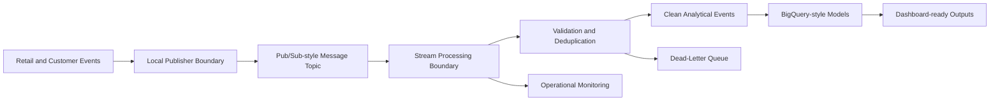

# GCP Real-Time Data Engineering Platform

A local-first, GCP-aligned real-time data engineering platform scaffold for retail and customer event analytics.

This repository is designed to show how a production-style streaming analytics platform can be structured before cloud resources or streaming logic are introduced. The project maps local modules and design documents to common GCP services such as Pub/Sub, Dataflow, BigQuery, Cloud Logging, and Cloud Monitoring, while keeping Milestone 1 focused on repository setup, documentation, quality gates, and a maintainable project layout.

## Problem Statement

Retail and customer analytics workloads often need to ingest high-volume behavioral events, validate event quality, process events with low latency, handle late or duplicate records, and publish dashboard-ready analytical outputs. Building this reliably requires more than a single script: it needs clear boundaries between ingestion, messaging, stream processing, quality validation, analytical modeling, replay handling, observability, and reporting.

This project will evolve toward that architecture incrementally. At this milestone, it establishes the professional scaffold only.

## Architecture Summary

The target design is a modular event analytics platform with clear separation of responsibilities:

- Event ingestion for retail, product, cart, order, and customer activity events.
- Pub/Sub-style messaging boundaries for decoupled producers and consumers.
- Dataflow / Apache Beam-style stream processing design for validation, enrichment, windowing, and late-event handling.
- BigQuery-style analytical models for clean events, hourly metrics, product activity, customer activity, and funnel analytics.
- Data quality validation rules for schema, required fields, accepted values, and event-time constraints.
- Reliability patterns for duplicate detection, idempotent writes, dead-letter handling, and replay workflows.
- Monitoring design for throughput, lag, errors, dead-letter volume, and data quality outcomes.



Additional Mermaid placeholders are available under `diagrams/`.

## Local-First Implementation Note

Milestone 1 does not provision cloud infrastructure, open GCP connections, or implement streaming behavior. The repository is intentionally local-first so that development, testing, and review can happen without credentials or live cloud dependencies.

Future milestones can map local interfaces to managed GCP services while preserving testable module boundaries.

## GCP Service Mapping

| Platform concern | Local-first placeholder | GCP-aligned service mapping |
| --- | --- | --- |
| Event publishing | `src/realtime_data_platform/publisher/` | Pub/Sub publisher |
| Message consumption | `src/realtime_data_platform/consumer/` | Pub/Sub subscriber |
| Stream processing | `src/realtime_data_platform/processing/`, `pipelines/` | Dataflow / Apache Beam |
| Event schemas | `configs/event_schema.yaml` | Pub/Sub schemas / registry-style governance |
| Quality rules | `configs/quality_rules.yaml` | Data quality checks before analytical storage |
| Analytical models | `sql/`, `configs/bigquery_tables.yaml` | BigQuery tables and views |
| Dead-letter handling | `docs/dead_letter_and_replay_strategy.md` | Pub/Sub dead-letter topics and replay workflows |
| Monitoring | `configs/monitoring_config.yaml`, `src/realtime_data_platform/monitoring/` | Cloud Logging and Cloud Monitoring |
| Dashboard outputs | `dashboard/`, `outputs/`, `reports/` | Looker Studio / BI-ready exports |

## Planned Milestone Roadmap

1. **Repo setup and professional project scaffold**: project structure, documentation, package skeleton, quality configuration, and CI.
2. **Synthetic retail event model and local event generation**: deterministic sample event contracts and local fixture generation.
3. **Local Pub/Sub-style messaging simulation**: local producer and consumer boundaries without cloud dependencies.
4. **Stream processing prototype**: local validation, deduplication, late-event handling, and dead-letter routing.
5. **BigQuery-style analytical modeling**: SQL models for clean events and dashboard-ready aggregates.
6. **Data quality and reliability workflows**: expanded rule validation, replay strategy, and idempotency checks.
7. **Monitoring and reporting outputs**: local operational metrics, report artifacts, and dashboard-ready views.
8. **Optional GCP deployment alignment**: infrastructure design and deployment guidance, without embedding credentials.

## Repository Structure

```text
.
├── configs/      # YAML placeholders for pipeline, schema, quality, monitoring, and table design
├── data/         # Local raw, processed, and sample data directories
├── src/          # Importable Python package skeleton
├── pipelines/    # Local and Beam/Dataflow pipeline placeholders
├── sql/          # BigQuery-style schema and analytical SQL placeholders
├── docs/         # Architecture, reliability, modeling, monitoring, and limitation notes
├── diagrams/     # Mermaid architecture diagram placeholders
├── dashboard/    # Dashboard placeholder for future Streamlit/local visualization work
├── tests/        # Lightweight scaffold and import tests
├── scripts/      # Local command placeholders for future workflows
└── .github/      # GitHub Actions CI workflow
```

## How To Run Checks Locally

Create and activate a virtual environment, then install the development dependencies:

```bash
python -m venv .venv
source .venv/bin/activate
python -m pip install -r requirements.txt
```

Run formatting, linting, and tests:

```bash
make check
```

Or run the steps individually:

```bash
ruff format --check .
ruff check .
pytest
```

## Portfolio Positioning

This repository is positioned as a production-style data engineering project scaffold. It emphasizes modular design, reliability patterns, analytical modeling boundaries, and cloud-aligned architecture without claiming live deployment. The aim is to make the design easy to review by data engineering, cloud engineering, and technical hiring audiences.

## Limitations

- No streaming logic is implemented yet.
- No synthetic event generation is implemented yet.
- No GCP resources are provisioned.
- No credentials, service accounts, or cloud deployment scripts are included.
- No benchmarking or performance claims are included.
- Dashboard files are placeholders only.

## Next Steps

The recommended next milestone is to define the synthetic retail event model and local sample event generation. That will give the platform a concrete event contract while still keeping the project local-first and testable.
