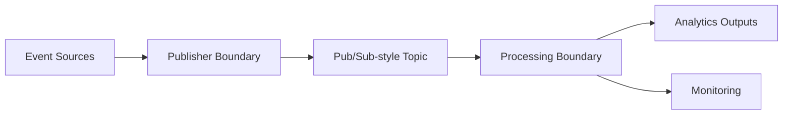

# Architecture

This placeholder describes the local-first platform architecture for real-time retail and customer event analytics.

```mermaid
flowchart LR
    A["Event Sources"] --> B["Publisher Boundary"]
    B --> C["Pub/Sub-style Topic"]
    C --> D["Processing Boundary"]
    D --> E["Analytics Outputs"]
    D --> F["Monitoring"]
```
